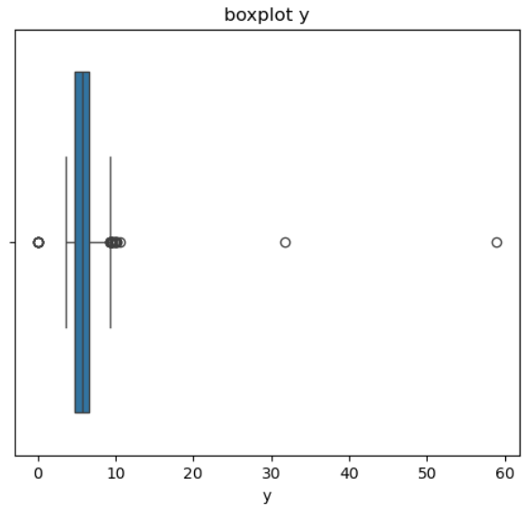

# Hands On Data Science Project with Python: Data Cleaning

## Project Overview
This project demonstrates the data cleaning process using Python, focusing on handling missing values, encoding categorical variables, and dealing with outliers in the dataset.

## Objectives
- Perform data cleaning on the provided dataset.
- Handle missing values appropriately.
- Encode categorical data.
- Detect and manage outliers in the dataset.

## Libraries Used
- Pandas
- NumPy
- Matplotlib
- Seaborn

## Dataset
- `diamonds_hw.csv`: Dataset containing information about diamonds, including price, carat, cut, color, clarity, and dimensions (x, y, z).

## Assignment Breakdown
1. **Importing Data**: 
   - Load the dataset and display the first few rows to verify the data.

2. **Data Exploration**: 
   - Understand the dataset with `.describe()` and `.info()` methods.

3. **Handling Missing Values**: 
   - There are missing values in the 'carat' column amounting to 25%. The 'carat' column is positively skewed, so the missing values will be handled using the median. 

4. **Encoding Categorical Data**: 
   - Perform encoding on the 'clarity' column.

5. **Outlier Detection and Handling**: 
   - The boxplot for x also shows many visible outliers 
   - In the boxplot for y, there are many outliers. 
   - In the boxplot for z, there are many outliers. 
After identifying outliers in the x, y, and z columns using the Interquartile Range (IQR) method, I decided to handle these outliers by applying data transformation. This method helps reduce the impact of outliers on the analysis without removing any data points.
## Repository Structure
- data/: Folder that contains the dataset (diamonds_hw.csv)
- notebooks/: Folder that contains Jupyter Notebooks for each step of the assignment
- visualizations/: Folder that stores the visualizations (e.g., boxplots)
